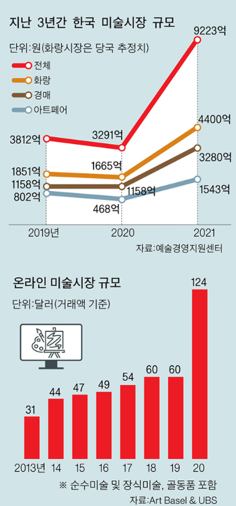
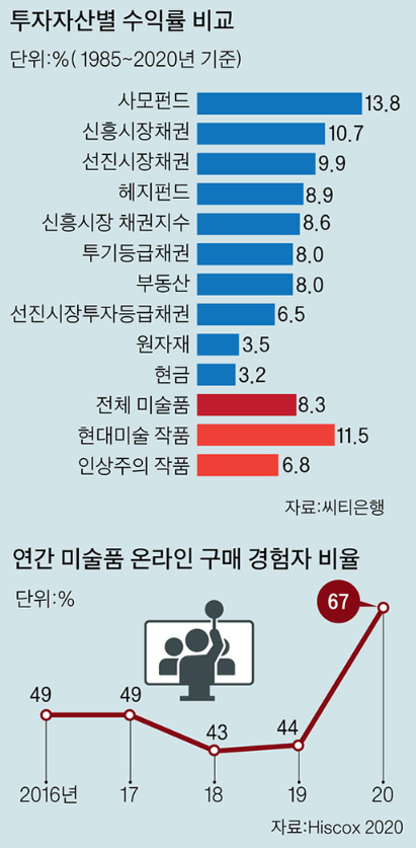
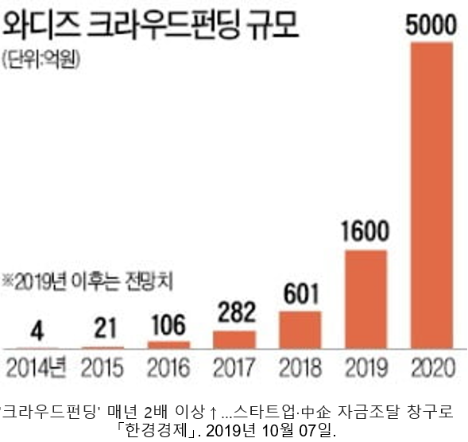
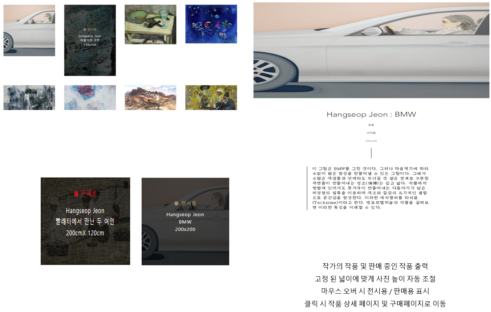
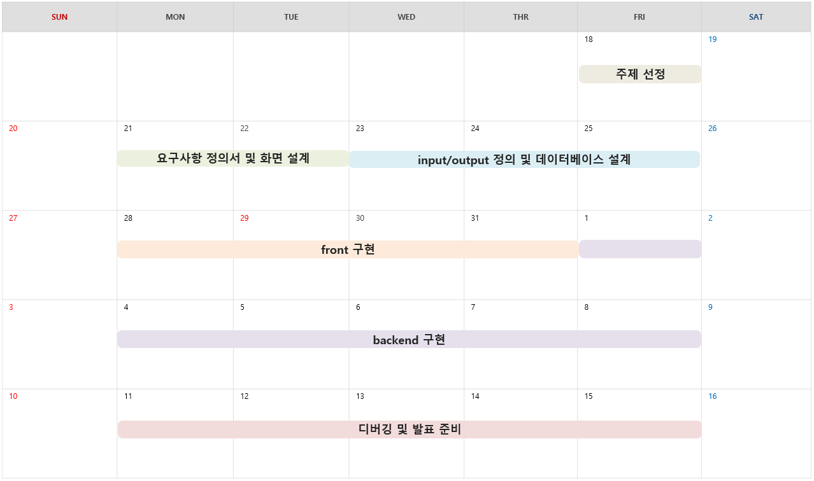
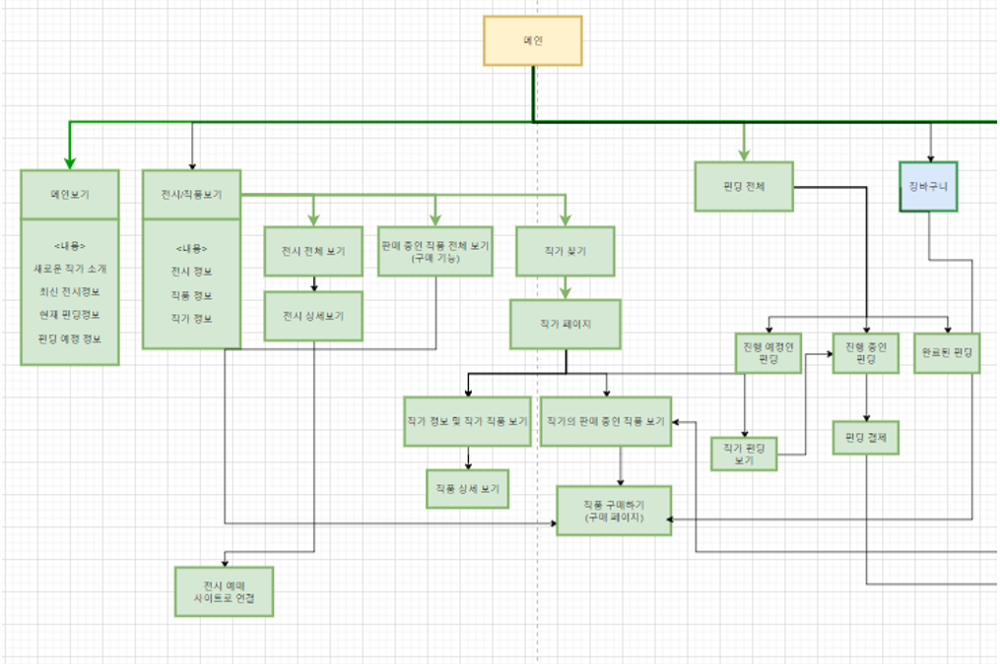
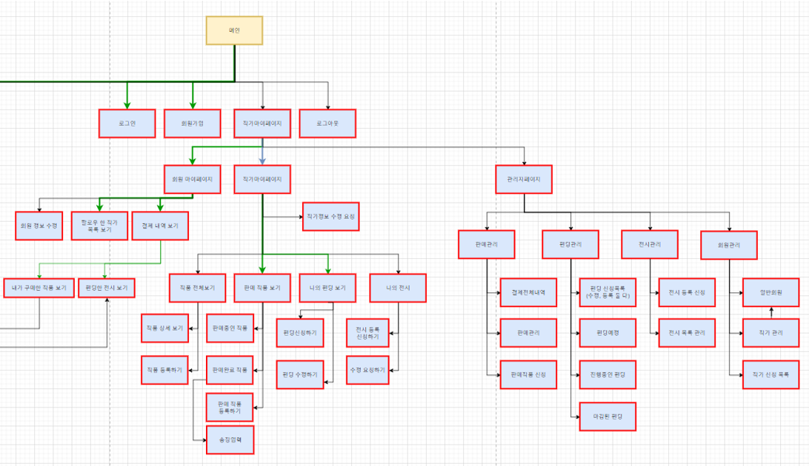
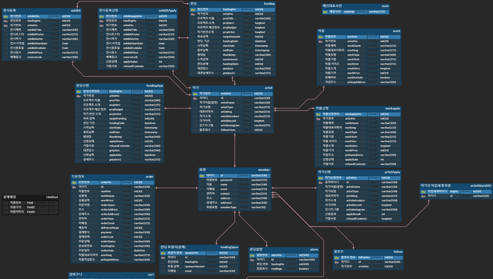

# 🏃‍♂ Aritsta 🏃‍♀

## Artista란 무엇일까?
- 독일어로 예술, 예술가를 의미
- 세련된 전시회 소개 사이트
- 작가들의 작품과 연혁을 소개 시켜주고 작품 판매까지 연결
- 자금이 부족해서 전시회를 갖지 못하는 작가들을 위한 펀딩 시스템
- 결과적으로 사람들에게 예술을 알리고 무명의 작가들에게 더 많은 기회를 제공

 

## 만들게 된 배경
- 한국의 예술시장의 규모가 급격하게 높아짐
- 미술품에 대한 펀드 및 투자 역시 급격하게 증가
- 젊은 작가들은 전시 비용이 없어 이름을 알릴 기회가 부족함
- 이처럼 예술에 대한 사람들의 관심이 높아지지만 관련 플랫폼 및 환경의 발전은 따라가지 못함
- 이러한 문제점들을 해결하기 위해서 프로젝트를 진행하게 

 

&ensp;&ensp;&ensp;&ensp;&ensp;
&ensp;&ensp;&ensp;&ensp;&ensp;
 

# Demo

 

# 프로젝트 일정

 

# 기능 구조

 <b>다이어그램</b> 

 
  

  
 

 

  
### 메인페이지

  
- 새로운 작가 소개  
- 최신 전시정보  
- 현재 펀딩정보  
- 펀딩 예정 정보

 

### 작품
- 전시 정보
- 작품 정보
- 작가 정보

 

### 펀딩
- 진행 예정 펀딩
- 진행 중인 펀딩
- 진행 완료 펀딩

 

### 장바구니
- 작품에 담아두기
- 작품 구매하기

 

### 사용자 
- 로그인
- 회원가입
- 마이페이지

사용자 기능
- 사용자 기능
- 결제 내역
- 펀딩 내역

작가 기능
- 작가 작품 관리
- 판매 작품 내역
- 작가 펀딩 내역
- 전시 내역

관리자 기능
- 판매 작품 관리
- 펀딩 관리
- 전시 관리
- 회원 관리

 
 

# 데이터베이스

 
 

# 팀원 및 

 <b>채효주(PL)</b> 

* 요구사항 설계서 작성
* 펀딩 리스트, 상세 페이지 ,결제 설계 및 구현
* 아티스트 펀딩 등록 및 수정 
* 펀딩 결제 api 구현
* Load More 버튼 구현

 

 <b>김상원</b> 

* 전체  페이지 디자인 설계
* 메인 페이지 설계 및 구현
* 전시 및 아티스트 페이지 설계 및 구현
* 슬라이드 구현
* 네비게이션 바 구현
* 아티스트 사진 랜덤 구현

 

 <b>홍성호</b> 

* 전체  페이지 디자인 설계
* 회원 마이페이지 설계 및 구현
* 로그인,  회원가입 설계 및 구현
* 스토어,  장바구니, 결제 설계 및 구현
* 네이버, 구글 로그인 api 사용
* 배송 조회 api 사용
* 작품 결제  api사용
* 팔로우 구현
* 서버관리
  

 

 <b>조예선</b> 
 

* 요구사항 설계서 작성
* 아티스트 마이페이지 설계 및 구현
* 관리자 페이지 설계 및 구현
* 관리자 페이지 전시, 회원, 아티스트, 펀딩 목록 구현 및 상세보기
* 아티스트 페이지 작품, 펀딩, 전시 목록 구현 및 상세보기

 
 

# 기술스택

 <b>Back-end</b> 

* JAVA SE-11
* Spring Boot
* Spring MVC
* Tomcat

 

 <b>Front-end</b> 

* HTML5
* CSS
* JavaScript
* jQuery
* BootStrap5

 

 <b>DBMS</b> 

* MySQL

 

 <b>DevOps</b> 

* Git/GitHub
* Naver Works
* oven.app
* erdcloud
* googleSheet

 

 <b>API & Library</b> 

* 결제 API
* SNS 로그인 API
* Ck Editor
* 배송 조회 API
  

예술가와 작품들을 간단히 소개 받을 수 있고
예술의 발전에 큰 일조를 할 수 있는 서비스

멀티캠퍼스 풀스택 프로젝트 
